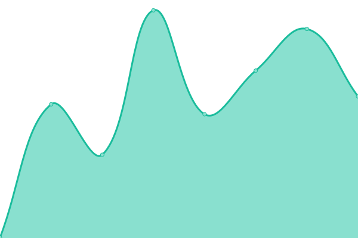
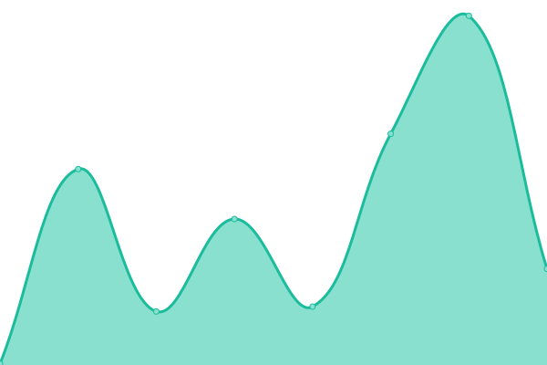
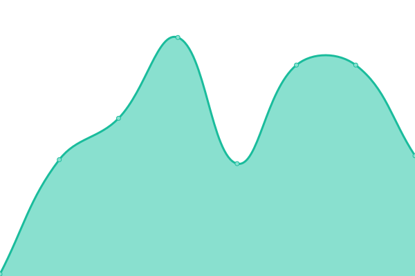

# [📈 Live Status](https://savvycodings.github.io/fermaUptime): <!--live status--> **🟧 Partial outage**

This repository contains the Uptime monitor and status page for [Fermah](https://www.fermah.xyz)

<!--start: status pages-->
<!-- This summary is generated by Upptime (https://github.com/upptime/upptime) -->
<!-- Do not edit this manually, your changes will be overwritten -->
<!-- prettier-ignore -->
| URL | Status | History | Response Time | Uptime |
| --- | ------ | ------- | ------------- | ------ |
|  [Fermah Website](https://www.fermah.xyz) | 🟩 Up | [fermah-website.yml](https://github.com/savvycodings/fermaUptime/commits/HEAD/history/fermah-website.yml) | 

 402ms
     
 | 

<a href="https://savvycodings.github.io/fermaUptime/history/fermah-website">100.00%</a>
    

|  [Fermah Docs](https://docs.fermah.xyz) | 🟩 Up | [fermah-docs.yml](https://github.com/savvycodings/fermaUptime/commits/HEAD/history/fermah-docs.yml) | 

 416ms
     
 | 

<a href="https://savvycodings.github.io/fermaUptime/history/fermah-docs">100.00%</a>
    

|  [Fermah Blog](https://www.fermah.xyz/blog) | 🟩 Up | [fermah-blog.yml](https://github.com/savvycodings/fermaUptime/commits/HEAD/history/fermah-blog.yml) | 

 98ms
     
 | 

<a href="https://savvycodings.github.io/fermaUptime/history/fermah-blog">100.00%</a>
    

|  [Fermah Testnet](https://www.fermah.xyz/testnet) | 🟩 Up | [fermah-testnet.yml](https://github.com/savvycodings/fermaUptime/commits/HEAD/history/fermah-testnet.yml) | 

 73ms
     
 | 

<a href="https://savvycodings.github.io/fermaUptime/history/fermah-testnet">100.00%</a>
    

|  [Fermah FailTestnet](https://failtestnet.fermah.xyz) | 🟥 Down | [fermah-fail-testnet.yml](https://github.com/savvycodings/fermaUptime/commits/HEAD/history/fermah-fail-testnet.yml) | 

 0ms
     
 | 

<a href="https://savvycodings.github.io/fermaUptime/history/fermah-fail-testnet">100.00%</a>
    

<!--end: status pages-->

[**Visit our status website →**](https://savvycodings.github.io/fermaUptime)
